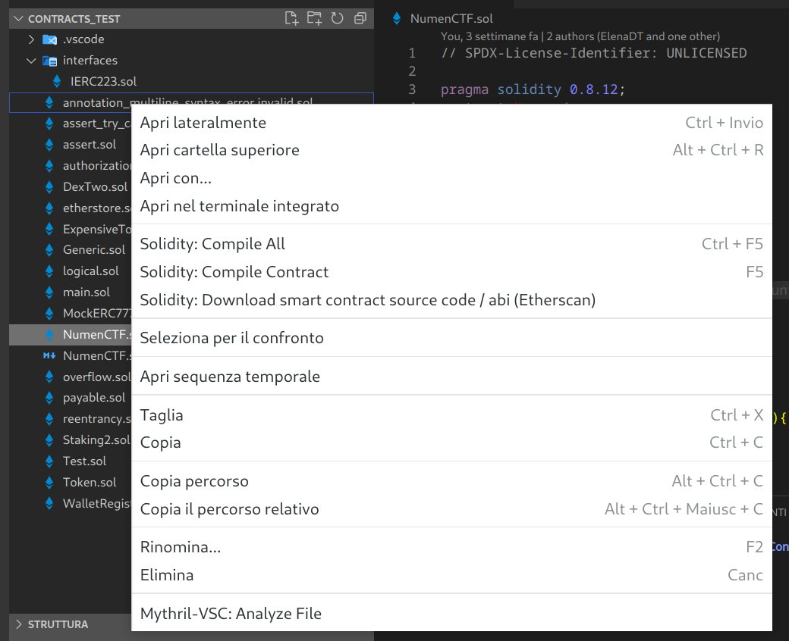
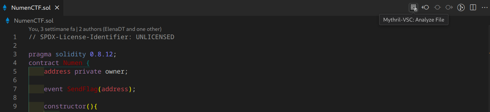
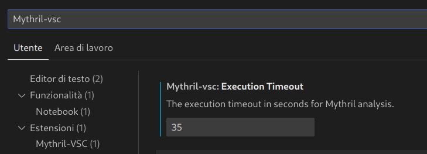

# mythril-vsc README

Un'estensione per integrare l'uso di Mythril in Visual Studio Code.

## Dipendenze

È necessario installare [Mythril insieme al compilatore per i file Solidity](https://mythril-classic.readthedocs.io/en/master/installation.html).

## Sviluppo

Il branch di sviluppo è `develop`.

- [Installare Mythril e Solc](#dipendenze);
- Clonare la presente repository;

> Dopo aver clonato questa repository, ricordare di lanciare `npm install` per avere tutte le **dipendenze** elencate nella sezione `devDependencies` del `package.json`.

### Debug

Si può testare l'applicazione clonando la presente repository e avviandone l'esecuzione con il debugger di VSC (premendo il tasto 'F5').

## Installazione dal codice binario

Se si vuole installare l'app per una demo, è possibile farlo con il file `.vsix` contenuto in questa repository.

### Istruzioni per installare VSIX da Visual Studio Code

- [Installare Mythril e Solc](#dipendenze);
- In VSC: Visualizza > Estensioni;
- click sui tre puntini in alto nel tab delle estensioni > "Installa da VSIX";
- Riavviare VSC, se necessario.

## Funzionalità

### Analisi dei contratti

Per lanciare l'analisi di un contratto, cliccare sul nome del file `<contratto>.sol` con il tasto destro > 'Mythril-VSC: Analyze File'.

In alternativa, se il contratto è aperto nell'editor, si può lanciare il comando 'Mythril-VSC: Analyze File' direttamente cliccando sull'icona in alto a destra come mostrato.

### Impostazioni dell'estensione

Dalle impostazioni è possibile scegliere il tempo di esecuzione del processo di analisi del contratto.

## Roadmap

Tra le funzionalità che intendo implementare ci sono:

- nelle impostazioni: permettere all'utente di scegliere il tipo di output generato dall'analisi (ex. Json, Json + Webview o Markdown);

- nel caso si scelga l'output 'Json + Webview', renderlo visibile con una [Webview](https://code.visualstudio.com/api/extension-guides/webview) aperta in una nuova tab di VSC;

- Aggingere il supporto per gli **import** della libreria [OpenZeppelin](https://www.npmjs.com/package/@openzeppelin/contracts#usage).

- nelle impostazioni: aggiungere ulteriori personalizzazioni per lanciare i comandi di Mythril.

## To Dos

- Studiare [altri metodi](https://code.visualstudio.com/api/extension-guides/overview) per rendere accessibili i comandi dalla UI.

- Controllare le [linee guida per la UX](https://code.visualstudio.com/api/ux-guidelines/overview).

- Migliorare l'icona dell'estensione.
